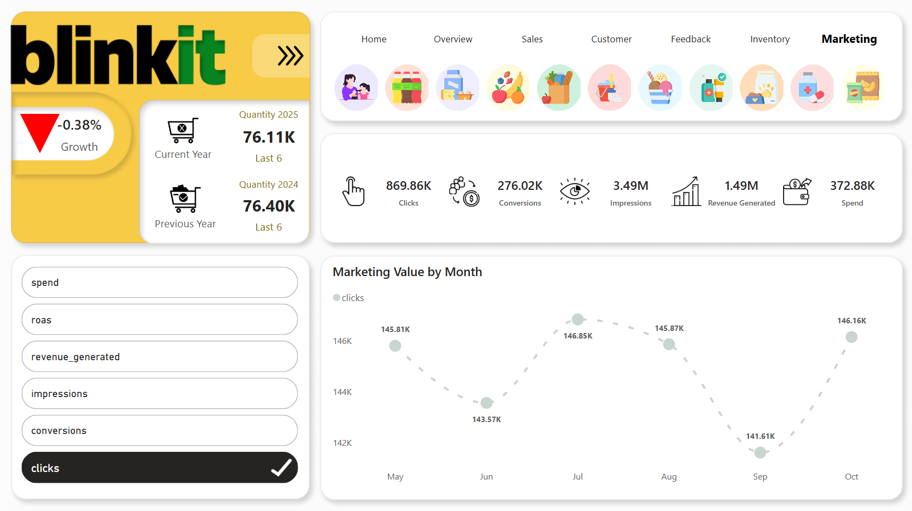

# **Blinkit Power BI Dashboard Project**

---

## **Context**  
Blinkit is a quick-commerce platform that delivers groceries and essentials in minutes. With its scale of operations, effective data management and visualization are critical to monitor performance, identify trends, and optimize operations.

---

## **Challenge**  
Managing large volumes of data, including orders, inventory, delivery times, customer feedback, and operational metrics, is overwhelming without a centralized dashboard. Inefficient decision-making can impact overall performance and customer satisfaction.

---

## **Goals**  
1. **Create a comprehensive dashboard to visualize key performance indicators (KPIs):**  
   - Daily, weekly, and monthly orders  
   - Delivery time trends and bottlenecks  
   - Inventory status and restocking needs  
   - Customer satisfaction ratings and feedback analysis  
   - Revenue and profit margins  

2. **Enable real-time updates and dynamic filtering for interactive data exploration.**  

3. **Provide actionable insights to improve operational efficiency and enhance the customer experience.**  

---

## **Target Audience**  
1. **Business Stakeholders:** For high-level performance summaries  
2. **Operations Managers:** For detailed process optimization  
3. **Data Analysts/Engineers:** For exploring backend data and extracting advanced insights  

---

## **Key Features**  
- Intuitive charts and graphs (e.g., bar charts, line graphs, pie charts) for quick understanding  
- Drill-down functionality for detailed data exploration  
- Filters for segmenting data by time periods, regions, or product categories  
- Export options to share reports with team members  

---

## **Expected Outcomes**  
1. A user-friendly dashboard empowering stakeholders to make data-driven decisions  
2. Enhanced operational efficiency through better data visibility  
3. A reusable template adaptable to other quick-commerce businesses  

---

## **Dashboard Components**

### **Overview Page**
- **Total Deliveries Over Time (Line Chart)**  
  - Data Shown: Delivery trends over specific periods (daily, weekly, monthly)  
  - **Business Implications:** Identify peak and off-peak periods to allocate resources effectively  

- **Delivery Completion Rate (Donut Chart)**  
  - Data Shown: Successful deliveries versus failed/delayed ones  
  - **Business Implications:** Address logistics issues causing delays or failed deliveries  

- **Revenue Contribution by Regions (Bar Chart)**  
  - Data Shown: Revenue split across geographical areas  
  - **Business Implications:** Analyze underperforming regions for potential improvements  

---

### **Customer Page**
- **Customer Retention Rate (Gauge Chart)**  
  - **Business Implications:** Evaluate loyalty programs and improve retention  

- **Top Customers by Revenue (Table)**  
  - **Business Implications:** Prioritize high-value customers with special offers  

- **Customer Feedback Trends (Word Cloud or Sentiment Analysis)**  
  - **Business Implications:** Understand customer perceptions and pinpoint improvement areas  

---

### **Marketing Page**
- **Campaign ROI Analysis (Bar or Funnel Chart)**  
  - **Business Implications:** Identify effective campaigns and optimize budgets  

- **Customer Acquisition by Channel (Pie Chart)**  
  - **Business Implications:** Focus on high-performing channels  

- **Marketing Spend by Region (Stacked Bar Chart)**  
  - **Business Implications:** Adjust regional strategies  

---

### **Inventory Page**
- **Stock Levels by Product Category (Bar Chart)**  
  - **Business Implications:** Avoid stockouts or overstock situations  

- **Inventory Turnover Ratio (KPI Card)**  
  - **Business Implications:** Improve replenishment cycles  

- **Low Stock Alerts (Heatmap or Table)**  
  - **Business Implications:** Ensure timely reordering  

---

### **Sales Overview Page**
- **Revenue by Product Category (Column Chart)**  
  - **Business Implications:** Adjust pricing and promotions  

- **Monthly Sales Trends (Line Chart)**  
  - **Business Implications:** Use seasonal trends for planning  

- **Average Order Value (KPI Card)**  
  - **Business Implications:** Encourage upselling strategies  

---

## **Why This Project?**  
This project provides hands-on experience with:  
- Advanced Power BI visualization techniques  
- Real-world dataset integration and analysis  
- Problem-solving using technology and analytics  

---

## **Images of the Dashboard**

1. **Home Page**  
   

2. **Overview Page**  
   

3. **Sales**  
   

4. **Customer**  
   

5. **Feedback**  
   

6. **Inventory Status**  
   

7. **Marketing**  
     
